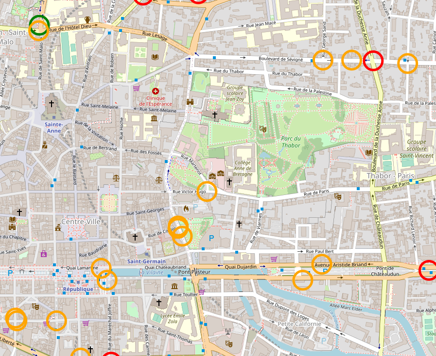

# bike_accident_cartography
First tentative to produce a cartography of bike accidents in France using opendata from French Gouvernement (from year 2015 to year 2019)
find the github pages here : https://guillermoandrade.github.io/bike_accident_cartography/

[Annual Evolution of number of persons with bikes in relation with trafic accidents in France by severity (_in french_)](evolution.html)

[Relative evolution (based on 2015) of number of persons with bikes in relation with trafic accidents in France by severity and compared to a global indice of bike frequency usage(_in french_)](relative_evolution.html)

[Cartography of accidents where bikes and electric bikes are implicated in France (_in french_)](map.html)

[Cartography of accidents where bikes and electric bikes are implicated in France when victim was in a professional traject (_in french_)](map_pro.html)                                
